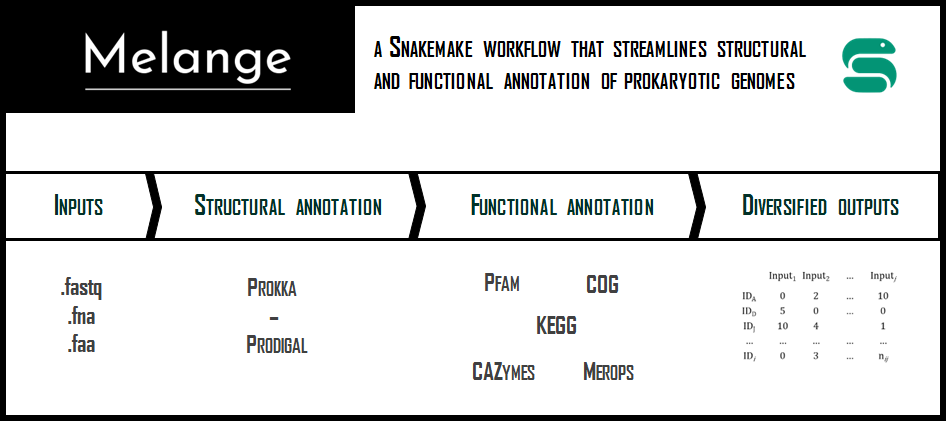
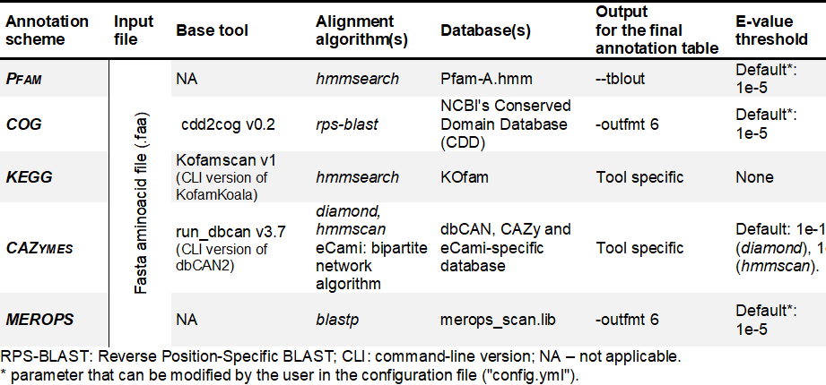
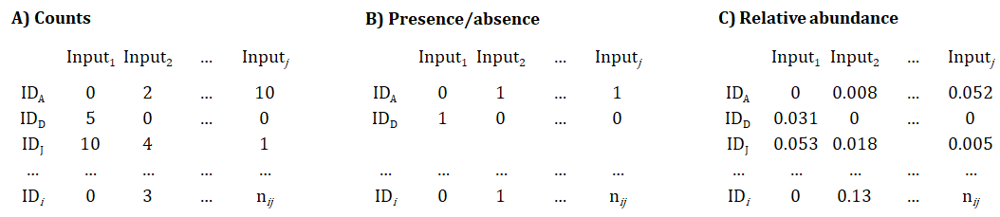

# Melange: A Snakemake workflow that streamlines structural and functional annotation of prokaryote genomes

 

<!--  -->

Full documentation: https://sandragodinhosilva.github.io/melange/

## 1 Overview 

- Melange is a genome annotation tool that enables the simultaneous annotation of large genome datasets using multiple databases: Pfam, COG, KEGG, CAZymes and/or MEROPS.
- Melange can handle unassembled and assembled sequencing data and amino acid sequences, with automatic download and configuration of necessary tools and databases.
- As a [Snakemake](https://snakemake.readthedocs.io/en/stable/#) pipeline, Melange is highly scalable, reproducible and has a transparent workflow, and can be used to annotate one to thousands of genomes, producing several easy-to-analyze [tabular outputs](#c-outputs).

    

**Sinopse:** *Melange - a versatile and user-friendly genome annotation tool that enables the simultaneous annotation of large genome datasets using multiple databases. Melange implementation in Snakemake allows flexibility and scalability. The unified output tables facilitate further analysis and are suitable for various comparative studies.*

## 2 System requirements

- Melange is designed to run on **Linux** systems and requires installation of **Python** (v≥3.8), **Snakemake** (v≥5.19.2) and **Conda** (v≥4.10.1). Optionally, **git** can also be installed for easy download of the repository. 
- Only databases selected in the *config.yml* file are downloaded and configured locally, reducing storage requirements to run Melange. 
- A test dataset (available in the *"example_data"* directory) is provided to allow for a test run to confirm the correct installation. 
- Melange utilizes [Snakemake](https://snakemake.readthedocs.io/en/stable/#) for modularity and automatic parallelization of jobs, making it suitable for implementation on high-performance computational clusters. For more details on that check ["Run on HPCs"](#).

## 3 Melange features

    

Melange allows the simultaneous functional annotation of prokaryote genomes or metagenomes with multiple annotation schemes. Here are illustrated all Melange features: 
- [A) Input files](#a-inputs): unassembled fastq, nucleotide fasta or amino acid fasta files (to be configured in *config.yml*)
- [B) Genome annotation](#b-genome-annotation): annotation databases (and respective search algorithm used to query the proteins): Pfam, COG, KEGG, CAZymes or MEROPS (to be configured in *config.yml*)
- [C) Outputs](#c-outputs) 

### A) Inputs
Melange accepts 3 types of input files: 
- unassembled (meta)genomic data (.fastq)
- (meta)genome assemblies (.fna, .fasta, .ffn, .faa, .frn, .fa)
- predicted amino acid sequences (.faa)

If *fastq files* are inputted, Melange will convert them to fasta nucleotide files using the [EMBOSS tool seqret](https://www.ebi.ac.uk/Tools/sfc/emboss_seqret/) before annotation. 

### B) Genome annotation

#### B1) Gene calling and general annotation
When nucleotide files are submitted, Melange first performs a structural annotation step using [Prokka v1.14.5](https://github.com/tseemann/prokka) [1] with default settings and outputs the corresponding translations into amino acid sequences in a fasta file. In addition to this output, which will be used in all subsequent steps, Prokka also generates other additional file formats, such as GenBank files, per genome. 

#### B2) Functional annotation
Melange allows functional annotation of genomes with up to five databases: Pfam, COG, KEGG, CAZymes and MEROPS.  

    

**Pfam**: For the annotation with Pfam identifiers, a local database is created using HMMER v3.3 from the latest version of Pfam-A.hmm file (currently v35.0) downloaded from the downloaded from the [InterPro repository](ftp://ftp.ebi.ac.uk/pub/databases/Pfam/current_release) A local database is constructed using HMMER v3.3. Once the local database has been created, query proteins are searched against it using the hmmscan function from the HMMER suite. The best hit per ORF (cut-off: -E 1e-5) is selected. 

**COG (Clusters of Orthologous Groups)**: The COG annotation procedure follows the [cdd2cog v0.2 workflow](https://github.com/aleimba/bac-genomics-scripts/tree/master/cdd2cog). First, several files are downloaded from the [NCBI's FTP server](https://ftp.ncbi.nlm.nih.gov/), including a preformatted database of the [NCBI's Conserved Domain Database (CDD) COG distribution](https://www.ncbi.nlm.nih.gov/cdd/) (2020 release). Query proteins are then blasted against this database using reverse position-specific BLAST (*rps-blast*) function from the Blast+ v2.9.0 suite and the results are parsed to a readable format with a Perl script (*cdd2cog.pl*). The best hit per ORF (cut-off: -E 1e-5) is selected. 

**KEGG (Kyoto Encyclopaedia of Genes and Genomes)**: To obtain the KEGG Orthology (KO) for protein identification, the command line (CLI) version of KofamKoala(https://www.genome.jp/tools/kofamkoala/) - [Kofamscan](https://github.com/takaram/kofam_scan) - is used. Kofamscan performs K number assignments using hidden Markov model (HMM) profile search, which involves searching query proteins against a customized HMM database of [KOs](ftp://ftp.genome.jp/pub/db/kofam) (KEGG release 103.0). This database includes predefined thresholds for individual KOs, resulting in more reliable assignments than sequence similarity searches. Kofamscan uses the *hmmsearch* function from the HMMER suite to perform the search. 

**CAZymes (Carbohydrate-active enzymes)**: The CAZymes annotation procedure uses the meta server [dbCAN3 - UPDATE](https://bcb.unl.edu/dbCAN2/), specifically, the standalone version [run_dbcan v2.0.11](https://github.com/linnabrown/run_dbcan) implemented with default settings. Run_dbcan is a tool that performs annotation of CAZymes using three different approaches: a HMMER v3.3 search against the dbCAN HMM database, a DIAMOND v0.9.32 search against the CAZy database, and the eCAMI algorithm. For improved annotation accuracy, ORFs are only annotated with the respective CAZyme name if at least two database searches were positive, as suggested by dbCAN2 authors in [Zhang et al.](https://pubmed.ncbi.nlm.nih.gov/29771380/).

**MEROPS**: For the identification of ORFs encoding for peptidases and their inhibitors the ["merops_scan.lib", release 12.4](ftp://ftp.ebi.ac.uk/pub/databases/merops/current_release/merops_scan.lib) file is downloaded from [MEROPS](https://www.ebi.ac.uk/merops/). Then *makedblast* is used to produce a local BLAST database. Query aminoacid sequences are then searched for matches with this database with *blastp*. 

### C) Outputs

Melange produces several different output formats tailored to meet users' diverse needs, with almost no additional computational cost. This is achieved by leveraging the output of each annotation database and transforming it into different tables. 

In summary, three files with distinct data representation modes are created for each annotation type: 
- **Counts**
- **Presence/absence (PA)** 
- **Relative abundance** 

     

In these output tables, each row represents a database identifier (ID), and each column represents an input (either nucleotide or amino acid (meta)genome files). 
While in counts **(A)**, nij represents the number of proteins or protein domains (depending on the database in use) identified with a certain ID for a given input, in the PA table **(B)**, nij equal to 1 indicates the existence of a certain identifier in the input, and 0 indicates its absence. In the relative abundance annotation table **(C)**, nij represents the normalized count of an ID per the total number of ORFs in each input.

**In addition to the annotation tables, Melange also provides - UPDATE:**
- descriptive file containing a summarized description of each annotation ID and an individual file per input listing all identified ORFs along with the matches inside each annotation database. 
- outputs related to the structural annotation procedure and intermediate files, including amino acid files, are also available for further analysis in a dedicated directory.

- Statistics.csv - % of Orfs annotated with each database.
- Pfam_description.csv, Cog_description.csv, Kegg_description.csv - the mapping of the identified annotation with clans, names, descriptions, etc.
- folder Orf_per_genome: each genome has a unique file containing all orfs identified by Prokka and the subsequent annotations with the four different databases.

## 4 Usage
This is a simple description on how to use melange. For more details, please see [Melange documentation](https://sandragodinhosilva.github.io/melange/).

### Step 0: Install conda and Snakemake
[Conda](https://conda.io/docs/) and [Snakemake](https://snakemake.readthedocs.io) are required to be able to use Melange. \
Conda is easy to install via its lightweight version [Miniconda](https://conda.io/miniconda.html). \
After installing Conda, install [Snakemake](https://snakemake.readthedocs.io/en/stable/getting_started/installation.html):

    # As described in Snakemake documentation:
    conda install -c conda-forge mamba
    mamba create -c conda-forge -c bioconda -n snakemake snakemake
    conda activate snakemake

### Step 1: Clone workflow
To use Melange, you need a local copy of the workflow repository. Start by
creating a clone of the repository: 

    git clone https://github.com/sandragodinhosilva/melange.git

### Step 2: Configure workflow
Configure the workflow according to your needs by editing the file `config.yaml`.

Here you can select which **databases** (Pfam, COG, Kegg, CAZymes and/or MEROPS) are to be used.

You can also define if input files are either fasta nucleotide files (e.g. fna, fa) or fasta aminoacid files.

More information about configuration settings can be found at: [config/README.md](https://github.com/sandragodinhosilva/melange/tree/master/config)

### Step 3: Execute workflow
Execute the workflow locally with `N` cores:

    snakemake --use-conda --cores N
    
Execution on a cluster, example:

    snakemake --use-conda --cluster qsub --jobs 8
    
For more information about running on a computational cluster, please check snakemake documentation about it: [https://snakemake.readthedocs.io/en/stable/executing/cluster.html](https://snakemake.readthedocs.io/en/stable/executing/cluster.html)

***
### Citing Melange
At the moment, Melange does not have a publication describing its features (we are working on it). Please use a link to Melange Github when referring to this tool.

### Melange Contributions
* Sandra Godinho Silva 1,2 - [MicroEcoEvo](https://www.facebook.com/MicroEcoEvo/) - [iBB, IST](https://ibb.tecnico.ulisboa.pt/).
* Tina Keller-Costa 1,2 - [MicroEcoEvo](https://www.facebook.com/MicroEcoEvo/) - [iBB, IST](https://ibb.tecnico.ulisboa.pt/).
* Ulisses Nunes da Rocha 3 - [Microbial Systems Data Science](https://www.ufz.de/index.php?de=43659) - [UFZ, Leipzig](https://www.ufz.de/).
* Rodrigo Costa 1,2 - [MicroEcoEvo](https://www.facebook.com/MicroEcoEvo/) - [iBB, IST](https://ibb.tecnico.ulisboa.pt/).

1 Institute for Bioengineering and Biosciences, Department of Bioengineering, Instituto Superior Técnico da Universidade de Lisboa, Lisbon, Portugal \
2 Associate Laboratory, Institute for Health and Bioeconomy, Instituto Superior Técnico, University of Lisbon, Lisbon, Portugal \
3 Department of Environmental Microbiology, Helmholtz Centre for Environmental Research – UFZ, Leipzig, Germany 

     

 

### Funding
 This work was supported by the Portuguese Foundation for Science and Technology (FCT) through the research project PTDC/MAR-BIO/1547/2014 and by ‘Direção-Geral de Política do Mar’, Ministry of the Sea through the “Fundo the Azul” funding program of  (grant number FA_05_2017_032). SGS is the recipient of a PhD scholarship conceded by FCT (PD/BD/143029/2018) and was supported by a FEMS-GO-2019-511 research and training grant conceded by the Federation of European Microbiological Societies (FEMS). Further support was provided from national funds through FCT in the scope of the projects UIDB/04565/2020 and UIDP/04565/2020 of the Research Unit Institute for Bioengineering and Biosciences - iBB and the project LA/P/0140/2020 of the Associate Laboratory Institute for Health and Bioeconomy - i4HB. UNR was funded by the Helmholtz Young Investigator grant VH-NG-1248 Micro “Big Data”. 

* * *

## References

* [1]	Seemann T. Prokka: rapid prokaryotic genome annotation. Bioinformatics. 2014;30(14):2068-9. 
* [2]	Galperin MY, Kristensen DM, Makarova KS, Wolf YI, Koonin EV. Microbial genome analysis: the COG approach. Brief Bioinform. 2019;20(4):1063-70. 
* [3]	Mistry J, Chuguransky S, Williams L, Qureshi M, Salazar GA, Sonnhammer ELL, et al. Pfam: The protein families database in 2021. Nucleic Acids Res. 2020. 
* [4]	Kanehisa M, Goto S. KEGG: kyoto encyclopedia of genes and genomes. Nucleic Acids Res. 2000;28(1):27-30.
