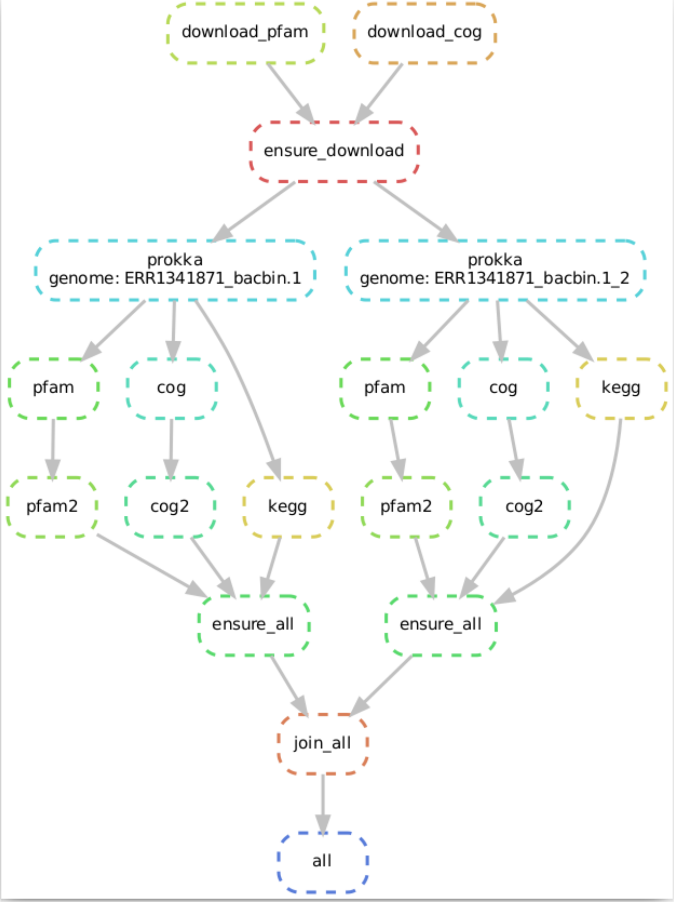

# Installation & Execution

MeLanGE is designed as a [Snakemake](https://snakemake.readthedocs.io) workflow that allows all steps to be executed in parallel on a cluster. 

## Step 0: MeLanGE dependencies
To run MeLanGE you need to have [conda](https://docs.conda.io/en/latest/) (or the simplest version - [miniconda](https://docs.conda.io/en/latest/miniconda.html)), [Snakemake](https://snakemake.readthedocs.io) and [Git](https://git-scm.com/) installed.

### Install conda 

To install conda, follow the instructions in conda documentation: [Conda](https://conda.io/docs/).
Most users will probably want to install [Miniconda](https://conda.io/miniconda.html). 

If you have not already done so, you will need to configure conda with the bioconda-channel and the conda-forge channel:

    conda config --add channels defaults
    conda config --add channels bioconda
    conda config --add channels conda-forge

### Install mamba (optional)
Conda can be a bit slow because there are so many packages. A good way around this is to use [Mamba](https://anaconda.org/conda-forge/mamba) (another snake).

    conda install mamba

From now on you can replace ``conda install`` with ``mamba install`` (check how much faster this snake is!)

### Install snakemake
After installing conda (and optionally mamba), install [Snakemake](https://snakemake.readthedocs.io/en/stable/getting_started/installation.html):

    mamba create -c conda-forge -c bioconda -n snakemake snakemake
    conda activate snakemake

### Install git
To run MeLange, you need to have git installed to clone the [MeLanGE repository](https://github.com/sandragodinhosilva/MeLanGE).

Instructions for installing git can be found at: [https://git-scm.com/book/en/v2/Getting-Started-Installing-Git](https://git-scm.com/book/en/v2/Getting-Started-Installing-Git)

## Step 1: Clone MeLanGE workflow
To use MeLanGE, you need a local copy of the [MeLanGE workflow repository](https://github.com/sandragodinhosilva/MeLanGE). Start by creating a clone of the repository: 

    git clone https://github.com/sandragodinhosilva/MeLanGE.git

Now you should have a folder called MeLanGE. In it you will find everything you need to run this workflow. To enter inside:

    cd MeLanGE

### Optional:  Test the correct installation with sample data
To test the correct installation of MeLanGE, you can use [example data](https://github.com/sandragodinhosilva/MeLanGE/tree/master/example_data). This data will be downloaded automatically when you clone the MeLanGE repository. Simply ensure the following setting in the `config.yaml` file:
    
    # --- Input
    inputdir: "example_data"

Test your configuration by doing a dry-run via:

    snakemake --use-conda -n

## Step 2: Configure workflow
Configure the workflow according to your needs by editing the file `config.yaml`.

To edit the `config.yaml` file you can use a text editor of your choice. 
For example with [nano](https://www.nano-editor.org/):
    
    nano config.yaml
    
    ## Useful commands: 
        Ctrl+O	Offer to write file ("Save as")
        Ctrl+X	Close buffer, exit from nano

For more information on customising this configuration file, see the section [MeLanGE Configuration](https://sandragodinhosilva.github.io/MeLanGE/configuration.html)

## Step 3: Execute workflow

Execute the workflow locally via

    snakemake --use-conda --cores N

This will run the workflow locally using `N` cores. 

### Optional steps 
**Examine workflow:**

Snakemake has some cool features implemented in MeLanGE. One of them is the ability to automatically create a directed acyclic graph (DAG) of jobs that allows visualisation of the entire workflow.

By executing a single command:

    snakemake --dag  | dot -Tsvg > dag.svg

A  DAG (saved as an .svg image) is created. It contains a node for each order, with the edges connecting them representing the dependencies. The frames of jobs that do not need to be executed (because their output is up to date) are dashed. 

Example:

**Investigate results:**

After successful execution, you can create a self-contained interactive HTML report with all results via:

    snakemake --report report.html
   
   
## Extra: Run MeLanGE on a high performance cluster

Snakemake can make use of cluster engines. In this case, Snakemake simply needs to be given a submit command that accepts a shell script as first positional argument:

    snakemake --cluster qsub --use-conda --jobs 4
